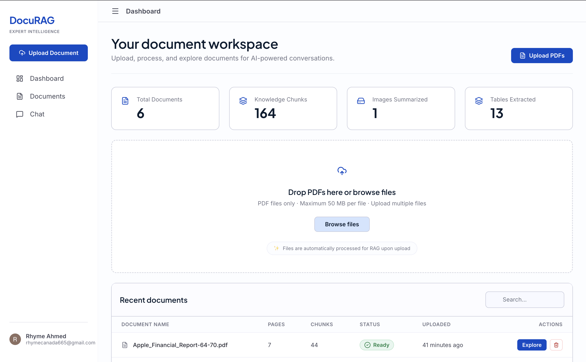
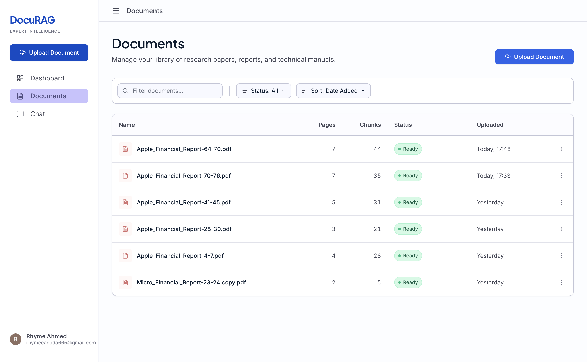
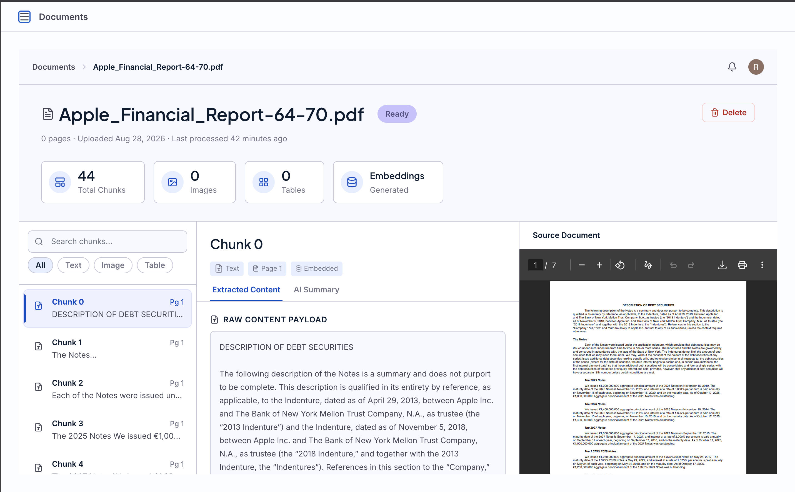
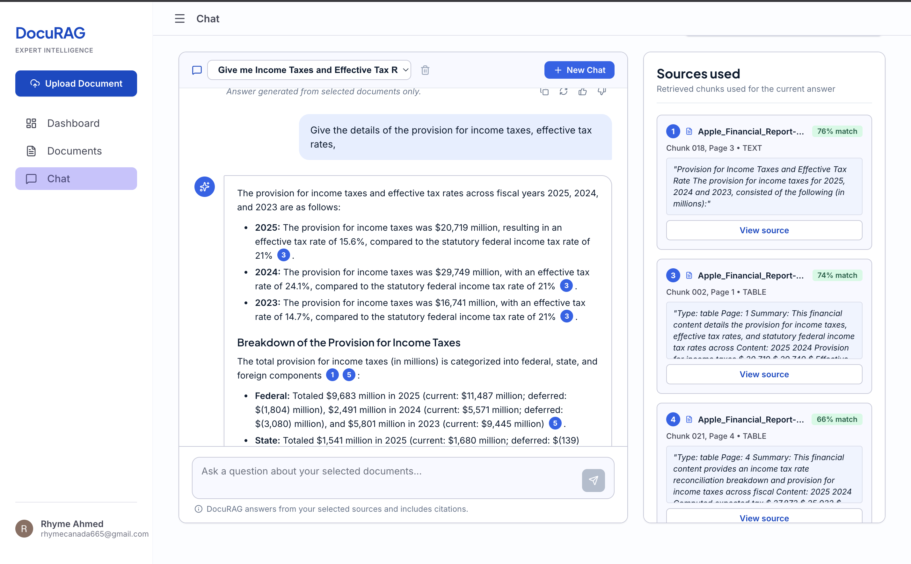
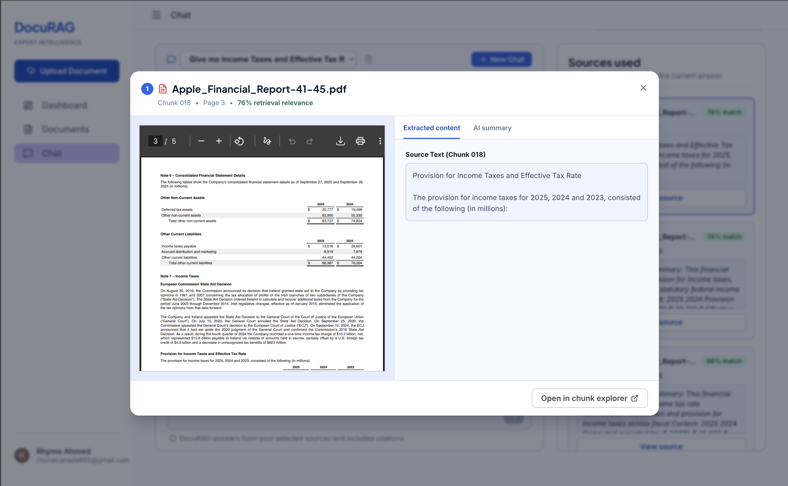

# Multi-Modal RAG for Financial Report Analysis



A custom Retrieval-Augmented Generation (RAG) system designed specifically to analyze and compare dense financial reports (e.g., 10-K, 10-Q forms) efficiently and accurately.

## Why This System?

Financial documents are typically 100-300 pages long. When users need to compare reports across 10-15 different companies, directly uploading all documents to a Large Language Model (LLM) will quickly exceed the context window, leading to information loss, hallucinations, or context degradation.

This project solves this by using a tailored RAG approach to selectively retrieve only the most relevant information needed to answer the user's questions. This drastically reduces context load while maintaining high accuracy, ensuring scalable and cost-effective multi-document querying.

## RAG Functionality & Methodology

Our specialized RAG pipeline ensures high-fidelity extraction and retrieval, specifically tuned for financial reports:

### 1. Advanced Document Partitioning
We use the **`unstructured`** library to partition PDFs and other document types. Financial reports rely heavily on non-text elements (charts, financial tables). The `unstructured` library is critical here because it seamlessly extracts **images and tables** in addition to raw text, ensuring no valuable data is left behind.

### 2. Context-Aware Chunking
For chunking the parsed data, this project uses **`chunk_by_title`**. After analysis of various financial reports, chunking by title proved to be the most effective approach. It respects the natural document hierarchy and section boundaries, providing much better context during retrieval than standard fixed-size or token-based chunking.

### 3. Multi-Modal Summarization (Images & Tables)
Before embedding the data, all extracted tables and images are passed through a vision-capable LLM to generate descriptive summaries. By embedding these summaries alongside the text, the RAG system gains full semantic understanding of visual and tabular data, allowing it to accurately answer questions based on charts and complex data tables.

### 4. Vector Storage and Retrieval
The text chunks and image/table summaries are converted into embeddings (using high-quality embedding models) and stored in a scalable **Pinecone** vector database. During querying, the system retrieves the most relevant multi-modal chunks to synthesize a complete and accurate answer.

## Technology & Architecture

The system is built with a modern, decoupled microservices architecture:

- **Frontend (React / Vite)**: A highly interactive UI for uploading documents, exploring chunked data, and chatting with the RAG assistant.
- **Node.js API (Express)**: Manages metadata, user sessions, document states, and acts as a gateway for the frontend.
- **Python RAG Service (FastAPI)**: A dedicated high-performance python microservice that handles all ML tasks: PDF partitioning (Unstructured), embedding generation, vector database interactions (Pinecone), and direct LLM calls (via OpenRouter/HTTPX).
- **Pinecone**: Cloud-based vector database for blazing-fast similarity search and scalable vector storage.
- **OpenRouter (OpenAI / Gemini)**: Used for embedding generation and multi-modal chat completions.

## Application Showcase

### Document Management & Processing
Upload and manage dense financial reports easily.


### Chunk Exploration
Inspect how documents were partitioned, including extracted tables and images.


### Interactive Chat & Source Attribution
Ask complex questions and view the exact source chunks (text, tables, and images) used to generate the answer.



## Getting Started

### Docker

Create the three application `.env` files from their `.env.example` files, then start the complete stack from the repository root:

```bash
docker compose up --build
```

The web app is available at `http://localhost:5173`. The Node API and Python RAG service are exposed on ports `4000` and `8000` respectively.
